# Previsão de demanda - Grupo Bimbo

## Introdução

O objetivo deste projeto é prever a demanda de produtos do Grupo Bimbo, em uma dada semana e loja. Para contextualização, o Grupo Bimbo é uma das maiores empresas de panificação do mundo, líder de mercado no México e na América Latina, e tem sua sede na Cidade do México.

O dataset contém dados de 9 semanas de transações de vendas no México, contendo as informações sobre os produtos entregues aos pontos de venda e as devoluções dos produtos que venceram nas prateleiras. A demanda de determinado produto em uma semana é definida como a diferença entre as vendas nesta semana e as devoluções da semana subsequente.

### Dicionário de dados:

Os datasets de treino e teste são divididos com base no tempo e estão disponíveis para download em: https://www.kaggle.com/c/grupo-bimbo-inventory-demand. Por razões de economia de espaço armazenado não serão replicados os *datasets* neste repositório.

Observações:

Há produtos no *dataset* de teste que não existem no dataset de treino. Este comportamento não está de acordo com o esperado com dados de demanda, uma vez que novos produtos são inseridos frequentemente. O modelo a ser construído deverá contornar este fato.
Há múltiplos dados com a mesma chave Cliente_ID na tabela cliente_tabla, o que significa que uma chave pode ter múltiplos nomes (NombreCliente) similares. Isto se deve ao fato de que o atributo NombreCliente não é padronizado, tendo ficado com a informação um pouco "ruidosa" nos dados brutos.

A demanda ajustada (Demanda_uni_equil) é sempre maior ou igual a 0, uma vez que que a demanda deve ser 0 ou um valore positivo. A razão pela qual Venta_uni_hoy e Dev_uni_proxima possuem às vezes valores negativos se deve ao fato de os registros de devoluções se acumularem por algumas semanas.

Descrição dos arquivos
train.csv — dataset de treino
test.csv — dataset de teste
sample_submission.csv — arquivo de submissão ao Kaggle no formato correto
cliente_tabla.csv — Nomes dos clientes (podem ser agregados aos dados de treino/teste pelo Cliente_ID)
producto_tabla.csv — Nomes dos produtos (podem ser agregados aos dados de treino/teste pelo Producto_ID)
town_state.csv — Cidade e estado (podem ser agregados aos dados de treino/teste pelo Agencia_ID)

Campos de dados
Semana — Número da semana (De quinta-feira a quarta-feira)
Agencia_ID — ID do depósito de vendas
Canal_ID — ID do canal de vendas
Ruta_SAK — ID da rota (Um depósito de vendas atende várias rotas)
Cliente_ID — ID do cliente
NombreCliente — Nome do cliente
Producto_ID — ID do produto
NombreProducto — Nome do produto
Venta_uni_hoy — Unidades vendidas nesta semana (integer)
Venta_hoy — Valor vendido nesta semana (unit: pesos)
Dev_uni_proxima — Unidades devolvidas na semana seguinte (integer)
Dev_proxima — Valor devolvido na semana seguinte (unit: pesos)
Demanda_uni_equil — Demanda ajustada em unidades (integer) (Esta é a variável target da predição)


### Análise exploratória de dados

```{r}
##################################################################
######### Projeto 2 - Previsão de demanda - Grupo Bimbo ##########
##################################################################

Azure <- FALSE

if(!Azure){
  
  setwd("C:/DataScience/FCD/BigDataAnalytics-R-Azure/Projeto-2/previsao_demanda_grupo_bimbo/")
  getwd()
  
}


############################################################
#### Carregamento de dados e bibliotecas ###################
############################################################

if(Azure){
  
  data <- maml.mapInputPort(1) # class: data.frame
  test <- maml.mapInputPort(2) # class: data.frame
  
}else{
  
  library(readr)
  data <- read_csv("dados/train_sample_v2.csv")
  test <- read_csv("dados/test.csv")
  
  #cliente_tabla <- read_csv("dados/cliente_tabla.csv")
  #producto_tabla <- read_csv("dados/producto_tabla.csv")
  #town_state <- read_csv("dados/town_state.csv")
  #sample_submission <- read_csv("dados/sample_submission.csv")
}


##############################################
#### Análise Exploratória dos Dados ##########
##############################################

head(data)
head(test)

# Únicas variáveis preditoras no test set:
# Semana, Agencia_ID, Canal_ID, Ruta_SAK, Cliente_ID, Producto_ID

#str(data)
summary(data)
summary(test)

# Verificando dados faltantes nos datasets

conta_NA <- function(X){
  return(sum(is.na(X)))
}

lapply(data, conta_NA)
lapply(test, conta_NA) 

# As variáveis Venta_uni_hoy Venta_hoy Dev_uni_proxima Dev_proxima não se encontram
# presentes no dataset de treinamento, portanto serão excluídas.

if(!Azure){
  data$Venta_hoy <- NULL
  data$Venta_uni_hoy <- NULL
  data$Dev_proxima <- NULL
  data$Dev_uni_proxima <- NULL
}


# Normalização dos dados do dataset data

min_data <- lapply(data, min)
max_data <- lapply(data, max)

min_test <- lapply(test, min)
max_test <- lapply(test, max)

normalizar <- function(x, min, max){
  return((x-min)/(max-min))
}

for(v in names(data)){
  
  if(v %in% names(test)){
    min <- min(min_data[[v]], min_test[[v]])
    max <- max(max_data[[v]], max_test[[v]])
  }else{
    min <- min_data[[v]]
    max <- max_data[[v]]
  }
  
  data[[v]] <- normalizar(data[[v]], min, max)
  
}

# Normalização do dataset test
# Não será feita a normalização do index, porque o index não é variável preditora.
for(v in names(test)[-1]){
  
  if(v %in% names(data)){
    min <- min(min_data[[v]], min_test[[v]])
    max <- max(max_data[[v]], max_test[[v]])
  }else{
    min <- min_test[[v]]
    max <- max_test[[v]]
  }
  
  test[[v]] <- normalizar(test[[v]], min, max)
  
}

################ Correlação ##########################

# Métodos de Correlação
# Pearson - coeficiente usado para medir o grau de relacionamento entre duas variáveis com relação linear
# Spearman - teste não paramétrico, para medir o grau de relacionamento entre duas variaveis
# Kendall - teste não paramétrico, para medir a força de dependência entre duas variaveis

# Vetor com os métodos de correlação
metodos <- c("pearson", "spearman")


# Aplicando os métodos de correlação com a função cor()
cors <- lapply(metodos, function(method) 
  (cor(data, method = method)))

head(cors)

# Preprando o plot
require(lattice)
plot.cors <- function(x, labs){
  diag(x) <- 0.0 
  plot( levelplot(x, 
                  main = paste("Plot de Correlação usando Metodo", labs,"com outliers"),
                  scales = list(x = list(rot = 90), cex = 1.0)) )
}

# Mapa de Correlação
Map(plot.cors, cors, metodos)


################# Boxplots #############################


boxplot(data, Demanda_uni_equil ~ ., col = "blue", main = "Boxplot com os outliers")


################ Histogramas ###########################

library(ggplot2)

lapply(names(data), function(x){
  ggplot(data, aes_string(x)) +
    geom_histogram(bins = 30L, fill = "blue", alpha = 0.5) +
    ggtitle(paste("Histograma de", x,"com outliers"))
})


############### Limpeza de outliers #####################

#data_copia <- data

#data <- data_copia


for(v in names(data)){
  
  upper_bound <- median(data[[v]]) + 3*mad(data[[v]])
  lower_bound <- median(data[[v]]) - 3*mad(data[[v]])
  data <- subset(data, data[[v]] <= upper_bound & data[[v]] >= lower_bound)
  print(v)
  print(nrow(data)) 
}

summary(data)


################ Histogramas ###########################

lapply(names(data), function(x){
  ggplot(data, aes_string(x)) +
    geom_histogram(bins = 100L, fill = "green", alpha = 0.5) +
    ggtitle(paste("Histograma de", x,"sem outliers"))
})

################# Boxplots #############################


boxplot(data[, -1], Demanda_uni_equil ~ ., col = "green", main = "Boxplot sem os outliers")

################ Nova Correlação ##########################

# Métodos de Correlação
# Pearson - coeficiente usado para medir o grau de relacionamento entre duas variáveis com relação linear
# Spearman - teste não paramétrico, para medir o grau de relacionamento entre duas variaveis
# Kendall - teste não paramétrico, para medir a força de dependência entre duas variaveis

# Vetor com os métodos de correlação
metodos <- c("pearson", "spearman")


# Aplicando os métodos de correlação com a função cor()
cors <- lapply(metodos, function(method) 
  (cor(data, method = method)))

head(cors)

# Preprando o plot
plot.cors <- function(x, labs){
  diag(x) <- 0.0 
  plot( levelplot(x, 
                  main = paste("Plot de Correlação usando metodo", labs, "sem outliers"),
                  scales = list(x = list(rot = 90), cex = 1.0)) )
}

# Mapa de Correlação
Map(plot.cors, cors, metodos)

############### Saída do bloco ########################

if(Azure){
  maml.mapOutputPort("data");
}

```
Devido a restrições de processamento da máquina local, o dataset foi reduzido através de um *sampling* do dataset original, com o processamento sendo replicado paralelamente no Azure ML. O primeiro modelo construído, mostrado na figura a seguir com modelos de regressão linear e rede neural apenas com uma normalização dos dados, mostrou um coeficiente de determinação (R²) próximo a zero, demandando uma maior análise dos dados para melhoria do desempenho. Deste ponto em diante, foram realizados vários testes, tanto no pré-processamento dos dados e de algoritmos de regressão, sempre com vistas a melhorar o coeficiente de determinação.
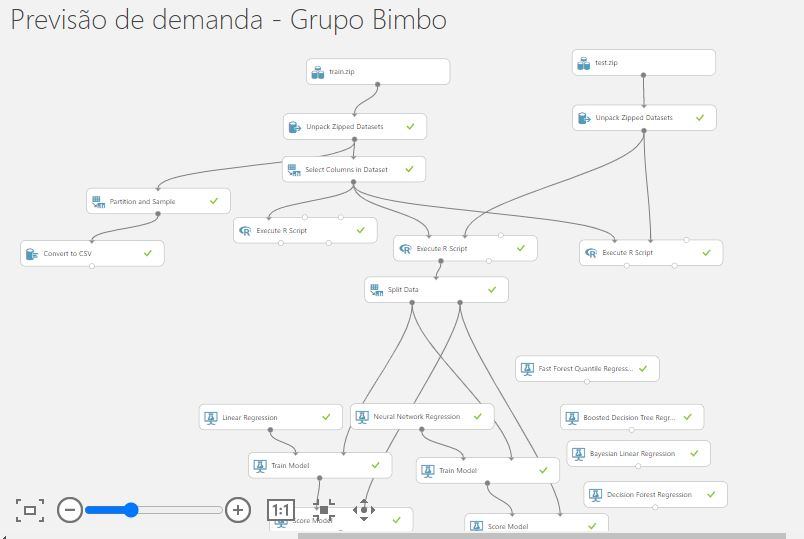


Dataset não possui valores missing. Nota-se numa primeira inspeção que as variáveis Venta_uni_hoy Venta_hoy Dev_uni_proxima Dev_proxima não se encontram presentes no dataset de treinamento e não devem, portanto, integrar a base de treinamento.

Para avaliar correlação entre variáveis, nas figuras abaixo foram gerados gráficos de correlação com os métodos *Spearman* e *Pearson*.
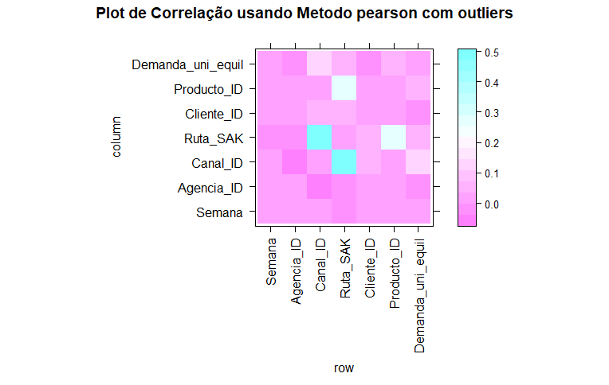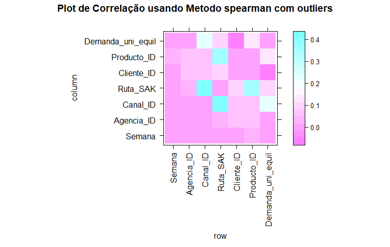

Graficamente não foi possível identificar nenhuma forte correlação entre as variáveis preditoras e a variável *target*.

Partiu-se, então, para uma análise mais detalhada dos dados. Primeiramente, foi gerado um *boxplot*, como mostrado abaixo, sendo possível identificar uma grande quantidade de *outliers*.
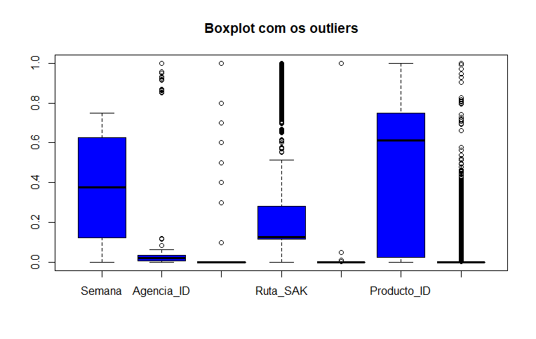

A partir disso, foram gerados histogramas para avaliar a distribuição dos dados e a influência dos *outliers* na distribuição dos mesmos, mostrados conforme se segue.
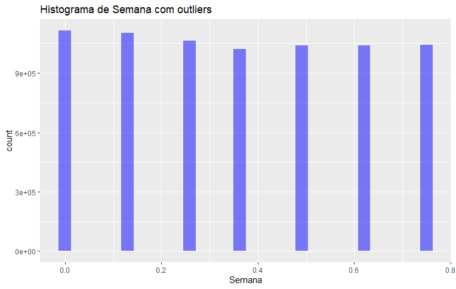
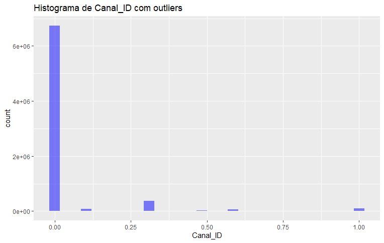
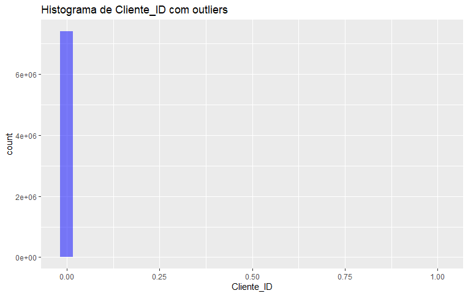
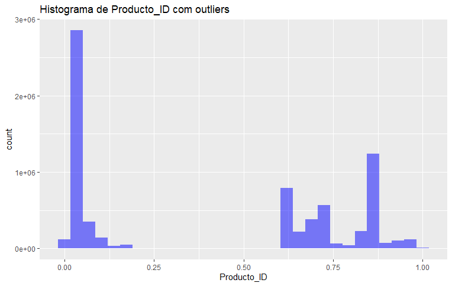
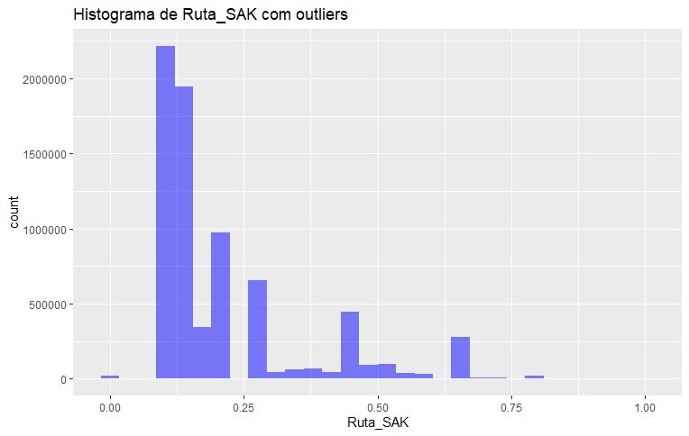
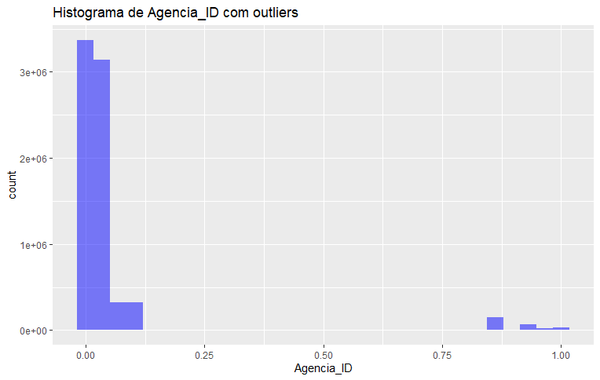
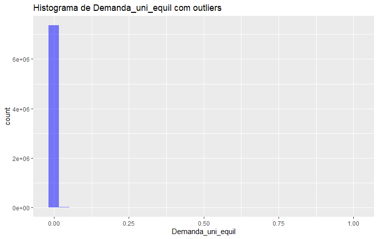

Para ilustrar a influência dos *outliers* na correlação entre os dados, foram retirados os valores discrepantes da base de dados em todos os atributos do *dataset* e avaliados o *boxplot* e os gráficos de correlação com os mesmos utilizados anteriormente, conforme mostrado nas figuras 12, 13 e 14. Percebe-se que o gráfico de correlação de Spearman para os dados sem outliers indica, por sua vez, que há uma correlação positiva mais forte entre a variável *target* e a variável Producto_ID, e uma correlação negativa mais forte com a variável Cliente_ID. Isto dá indícios que a relação entre os dados de entrada e de saída pode estar sendo mascarada pelos outliers. No entanto, o método utilizado para exclusão dos outliers eliminou 65% dos dados originais, o que compromete a análise pois os modelos perdem generalidade com esta menor variabilidade dos dados.
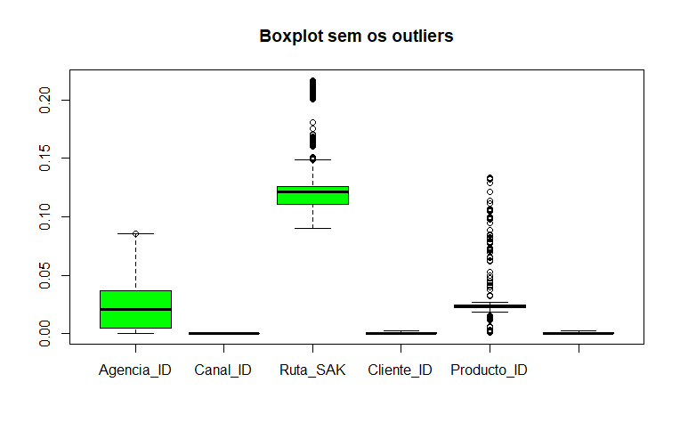
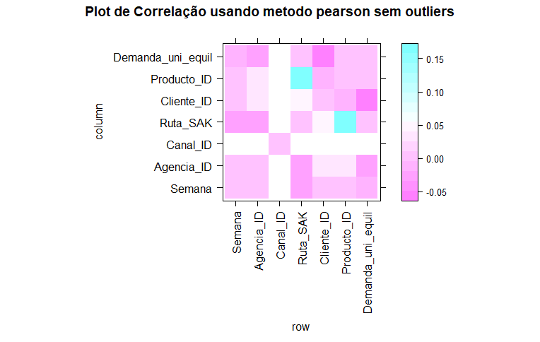
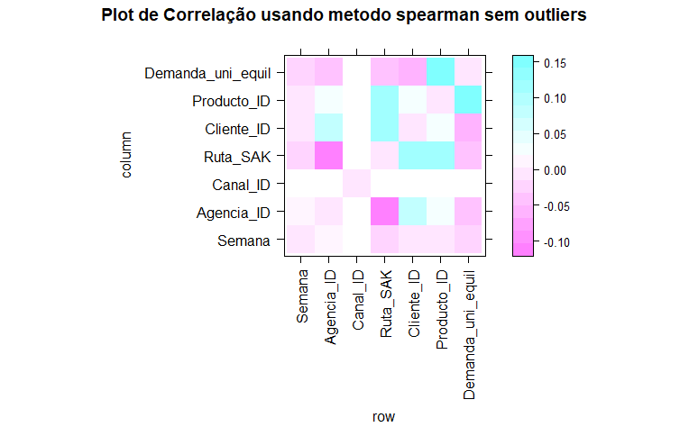

Ainda com os *outliers* excluídos foram comparados 2 modelos de regressão para os dados: a regressão de Poisson e o algortimo de regressão *Boosted Decision Tree*. Os resultados podem ser vistos a seguir:


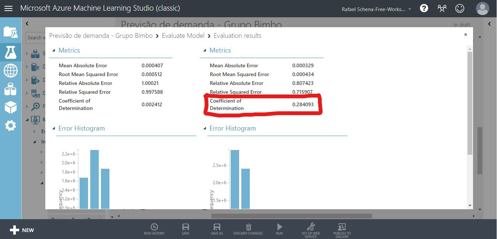

Pode-se observar que o coeficiente de determinação R² aumentou para 0,284093, porém ainda é um número considerado baixo, de modo que o processo de *data munging* será continuado.

Alternativamente, foi rodado novamente o experimento no AzureML com um *feature selection* das 4 variáveis mais importantes sem a exclusão dos *outliers*, conforme mostrado abaixo, de onde se pode ver que houve um aumento do R².

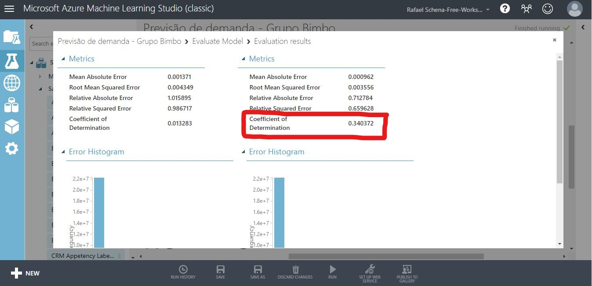

Também foi refeito o mesmo experimento com a exclusão apenas dos *ouliers* da variável target, eliminando aproximadamente 13% dos dados de treinamento, o que causou uma diminuição do coeficiente de determinação, conforme mostrado a seguir:

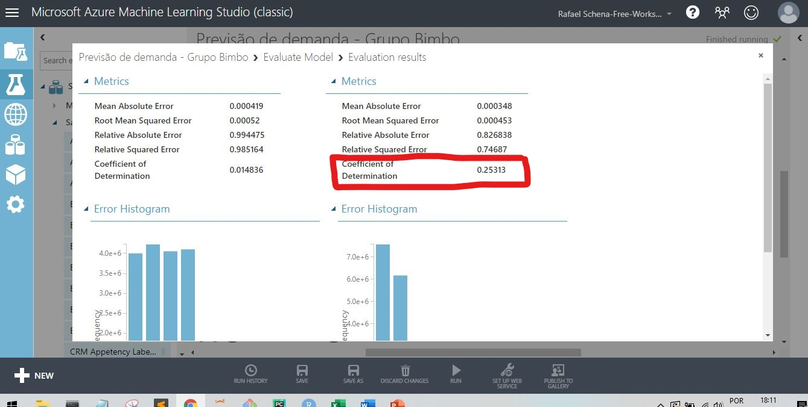
Ou seja, mesmo com uma exclusão de um número menor de dados *outliers*, houve uma perda na capacidade de generalização do modelo gerado.

Após isso, dado o resultado do último experimento, resolveu-se testar o desempenho sem retirada dos *outliers* e também sem a normalização. A resultado é mostrado abaixo:

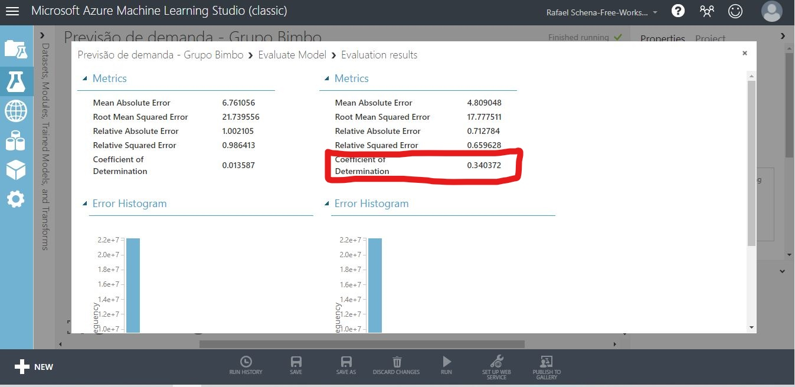
