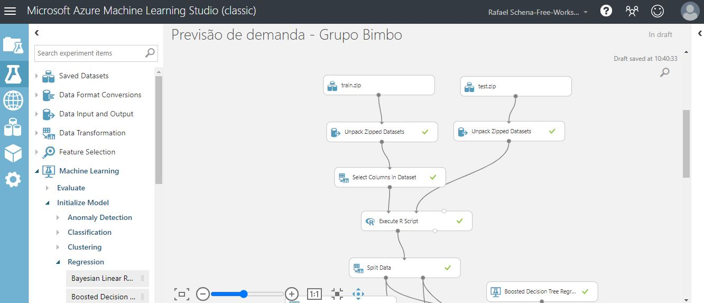
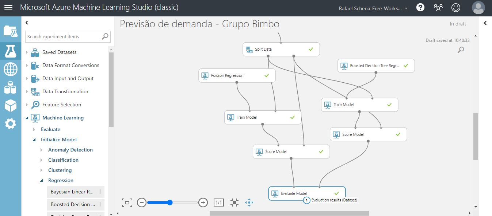
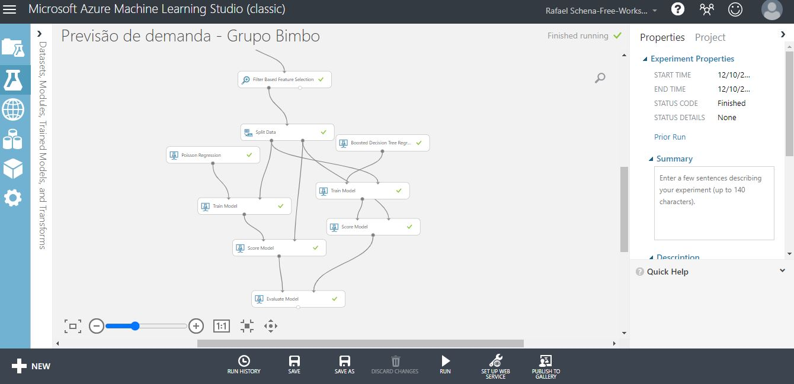
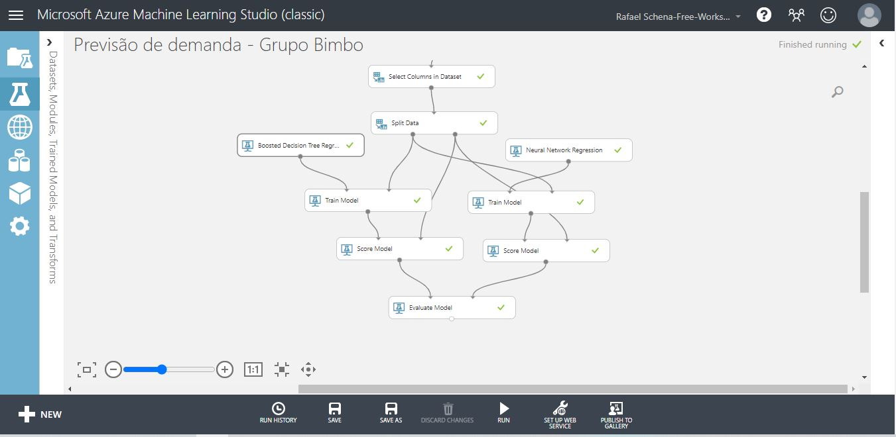
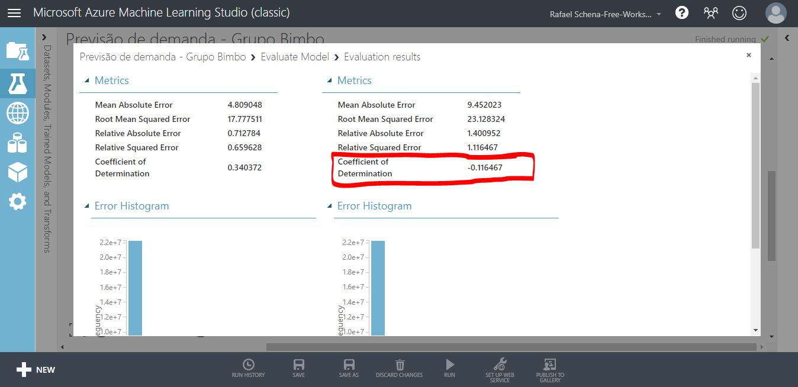
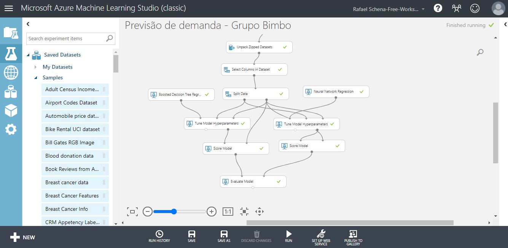
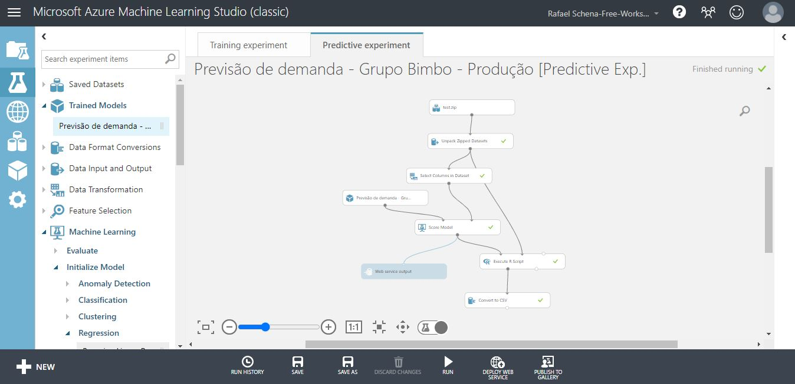

# Previsão de demanda - Grupo Bimbo
Projeto 2 do Curso Big Data Analytics

## Introdução

O objetivo deste projeto é prever a demanda de produtos do Grupo Bimbo, em uma dada semana e loja. Para contextualização, o Grupo Bimbo é uma das maiores empresas de panificação do mundo, líder de mercado no México e na América Latina, e tem sua sede na Cidade do México.

O dataset contém dados de 9 semanas de transações de vendas no México, contendo as informações sobre os produtos entregues aos pontos de venda e as devoluções dos produtos que venceram nas prateleiras. A demanda de determinado produto em uma semana é definida como a diferença entre as vendas nesta semana e as devoluções da semana subsequente.

### Dicionário de dados:

Os datasets de treino e teste são divididos com base no tempo e estão disponíveis para download em: https://www.kaggle.com/c/grupo-bimbo-inventory-demand. Por razões de economia de espaço armazenado não serão replicados os *datasets* neste repositório.

Observações:

Há produtos no *dataset* de teste que não existem no dataset de treino. Este comportamento não está de acordo com o esperado com dados de demanda, uma vez que novos produtos são inseridos frequentemente. O modelo a ser construído deverá contornar este fato.
Há múltiplos dados com a mesma chave Cliente_ID na tabela cliente_tabla, o que significa que uma chave pode ter múltiplos nomes (NombreCliente) similares. Isto se deve ao fato de que o atributo NombreCliente não é padronizado, tendo ficado com a informação um pouco "ruidosa" nos dados brutos.

A demanda ajustada (Demanda_uni_equil) é sempre maior ou igual a 0, uma vez que que a demanda deve ser 0 ou um valore positivo. A razão pela qual Venta_uni_hoy e Dev_uni_proxima possuem às vezes valores negativos se deve ao fato de os registros de devoluções se acumularem por algumas semanas.

Descrição dos arquivos
train.csv — dataset de treino
test.csv — dataset de teste
sample_submission.csv — arquivo de submissão ao Kaggle no formato correto
cliente_tabla.csv — Nomes dos clientes (podem ser agregados aos dados de treino/teste pelo Cliente_ID)
producto_tabla.csv — Nomes dos produtos (podem ser agregados aos dados de treino/teste pelo Producto_ID)
town_state.csv — Cidade e estado (podem ser agregados aos dados de treino/teste pelo Agencia_ID)

Campos de dados
Semana — Número da semana (De quinta-feira a quarta-feira)
Agencia_ID — ID do depósito de vendas
Canal_ID — ID do canal de vendas
Ruta_SAK — ID da rota (Um depósito de vendas atende várias rotas)
Cliente_ID — ID do cliente
NombreCliente — Nome do cliente
Producto_ID — ID do produto
NombreProducto — Nome do produto
Venta_uni_hoy — Unidades vendidas nesta semana (integer)
Venta_hoy — Valor vendido nesta semana (unit: pesos)
Dev_uni_proxima — Unidades devolvidas na semana seguinte (integer)
Dev_proxima — Valor devolvido na semana seguinte (unit: pesos)
Demanda_uni_equil — Demanda ajustada em unidades (integer) (Esta é a variável target da predição)


## Análise exploratória de dados

```{r}
##################################################################
######### Projeto 2 - Previsão de demanda - Grupo Bimbo ##########
##################################################################

Azure <- FALSE

if(!Azure){
  
  setwd("C:/DataScience/FCD/BigDataAnalytics-R-Azure/Projeto-2/previsao_demanda_grupo_bimbo/")
  getwd()
  
}


############################################################
#### Carregamento de dados e bibliotecas ###################
############################################################

if(Azure){
  
  data <- maml.mapInputPort(1) # class: data.frame
  test <- maml.mapInputPort(2) # class: data.frame
  
}else{
  
  library(readr)
  data <- read_csv("dados/train_sample_v2.csv")
  test <- read_csv("dados/test.csv")
  
  #cliente_tabla <- read_csv("dados/cliente_tabla.csv")
  #producto_tabla <- read_csv("dados/producto_tabla.csv")
  #town_state <- read_csv("dados/town_state.csv")
  #sample_submission <- read_csv("dados/sample_submission.csv")
}


##############################################
#### Análise Exploratória dos Dados ##########
##############################################

head(data)
head(test)

# Únicas variáveis preditoras no test set:
# Semana, Agencia_ID, Canal_ID, Ruta_SAK, Cliente_ID, Producto_ID

#str(data)
summary(data)
summary(test)

# Verificando dados faltantes nos datasets

conta_NA <- function(X){
  return(sum(is.na(X)))
}

lapply(data, conta_NA)
lapply(test, conta_NA) 

# As variáveis Venta_uni_hoy Venta_hoy Dev_uni_proxima Dev_proxima não se encontram
# presentes no dataset de treinamento, portanto serão excluídas.

if(!Azure){
  data$Venta_hoy <- NULL
  data$Venta_uni_hoy <- NULL
  data$Dev_proxima <- NULL
  data$Dev_uni_proxima <- NULL
}


# Normalização dos dados do dataset data

min_data <- lapply(data, min)
max_data <- lapply(data, max)

min_test <- lapply(test, min)
max_test <- lapply(test, max)

normalizar <- function(x, min, max){
  return((x-min)/(max-min))
}

for(v in names(data)){
  
  if(v %in% names(test)){
    min <- min(min_data[[v]], min_test[[v]])
    max <- max(max_data[[v]], max_test[[v]])
  }else{
    min <- min_data[[v]]
    max <- max_data[[v]]
  }
  
  data[[v]] <- normalizar(data[[v]], min, max)
  
}

# Normalização do dataset test
# Não será feita a normalização do index, porque o index não é variável preditora.
for(v in names(test)[-1]){
  
  if(v %in% names(data)){
    min <- min(min_data[[v]], min_test[[v]])
    max <- max(max_data[[v]], max_test[[v]])
  }else{
    min <- min_test[[v]]
    max <- max_test[[v]]
  }
  
  test[[v]] <- normalizar(test[[v]], min, max)
  
}

################ Correlação ##########################

# Métodos de Correlação
# Pearson - coeficiente usado para medir o grau de relacionamento entre duas variáveis com relação linear
# Spearman - teste não paramétrico, para medir o grau de relacionamento entre duas variaveis
# Kendall - teste não paramétrico, para medir a força de dependência entre duas variaveis

# Vetor com os métodos de correlação
metodos <- c("pearson", "spearman")


# Aplicando os métodos de correlação com a função cor()
cors <- lapply(metodos, function(method) 
  (cor(data, method = method)))

head(cors)

# Preprando o plot
require(lattice)
plot.cors <- function(x, labs){
  diag(x) <- 0.0 
  plot( levelplot(x, 
                  main = paste("Plot de Correlação usando Metodo", labs,"com outliers"),
                  scales = list(x = list(rot = 90), cex = 1.0)) )
}

# Mapa de Correlação
Map(plot.cors, cors, metodos)


################# Boxplots #############################


boxplot(data, Demanda_uni_equil ~ ., col = "blue", main = "Boxplot com os outliers")


################ Histogramas ###########################

library(ggplot2)

lapply(names(data), function(x){
  ggplot(data, aes_string(x)) +
    geom_histogram(bins = 30L, fill = "blue", alpha = 0.5) +
    ggtitle(paste("Histograma de", x,"com outliers"))
})


############### Limpeza de outliers #####################

#data_copia <- data

#data <- data_copia


for(v in names(data)){
  
  upper_bound <- median(data[[v]]) + 3*mad(data[[v]])
  lower_bound <- median(data[[v]]) - 3*mad(data[[v]])
  data <- subset(data, data[[v]] <= upper_bound & data[[v]] >= lower_bound)
  print(v)
  print(nrow(data)) 
}

summary(data)


################ Histogramas ###########################

lapply(names(data), function(x){
  ggplot(data, aes_string(x)) +
    geom_histogram(bins = 100L, fill = "green", alpha = 0.5) +
    ggtitle(paste("Histograma de", x,"sem outliers"))
})

################# Boxplots #############################


boxplot(data[, -1], Demanda_uni_equil ~ ., col = "green", main = "Boxplot sem os outliers")

################ Nova Correlação ##########################

# Métodos de Correlação
# Pearson - coeficiente usado para medir o grau de relacionamento entre duas variáveis com relação linear
# Spearman - teste não paramétrico, para medir o grau de relacionamento entre duas variaveis
# Kendall - teste não paramétrico, para medir a força de dependência entre duas variaveis

# Vetor com os métodos de correlação
metodos <- c("pearson", "spearman")


# Aplicando os métodos de correlação com a função cor()
cors <- lapply(metodos, function(method) 
  (cor(data, method = method)))

head(cors)

# Preprando o plot
plot.cors <- function(x, labs){
  diag(x) <- 0.0 
  plot( levelplot(x, 
                  main = paste("Plot de Correlação usando metodo", labs, "sem outliers"),
                  scales = list(x = list(rot = 90), cex = 1.0)) )
}

# Mapa de Correlação
Map(plot.cors, cors, metodos)

############### Saída do bloco ########################

if(Azure){
  maml.mapOutputPort("data");
}

```
Devido a restrições de processamento da máquina local, o dataset foi reduzido através de um *sampling* do dataset original, com o processamento sendo replicado paralelamente no Azure ML. O primeiro modelo construído, mostrado na figura a seguir com modelos de regressão linear e rede neural apenas com uma normalização dos dados, mostrou um coeficiente de determinação (R²) próximo a zero, demandando uma maior análise dos dados para melhoria do desempenho. Deste ponto em diante, foram realizados vários testes, tanto no pré-processamento dos dados e de algoritmos de regressão, sempre com vistas a melhorar o coeficiente de determinação.


Dataset não possui valores missing. Nota-se numa primeira inspeção que as variáveis Venta_uni_hoy Venta_hoy Dev_uni_proxima Dev_proxima não se encontram presentes no dataset de treinamento e não devem, portanto, integrar a base de treinamento.

Para avaliar correlação entre variáveis, nas figuras abaixo foram gerados gráficos de correlação com os métodos *Spearman* e *Pearson*.


Graficamente não foi possível identificar nenhuma forte correlação entre as variáveis preditoras e a variável *target*.

Partiu-se, então, para uma análise mais detalhada dos dados. Primeiramente, foi gerado um *boxplot*, como mostrado abaixo, sendo possível identificar uma grande quantidade de *outliers*.


A partir disso, foram gerados histogramas para avaliar a distribuição dos dados e a influência dos *outliers* na distribuição dos mesmos, mostrados conforme se segue.


Para ilustrar a influência dos *outliers* na correlação entre os dados, foram retirados os valores discrepantes da base de dados em todos os atributos do *dataset* e avaliados o *boxplot* e os gráficos de correlação com os mesmos utilizados anteriormente, conforme mostrado nas figuras 12, 13 e 14. Percebe-se que o gráfico de correlação de Spearman para os dados sem outliers indica, por sua vez, que há uma correlação positiva mais forte entre a variável *target* e a variável Producto_ID, e uma correlação negativa mais forte com a variável Cliente_ID. Isto dá indícios que a relação entre os dados de entrada e de saída pode estar sendo mascarada pelos outliers. No entanto, o método utilizado para exclusão dos outliers eliminou 65% dos dados originais, o que compromete a análise pois os modelos perdem generalidade com esta menor variabilidade dos dados.


## Modelos de Machine Learning

#### Experimento 1
Ainda com os *outliers* excluídos foram comparados 2 modelos de regressão para os dados: a regressão de Poisson e o algortimo de regressão *Boosted Decision Tree*. Os resultados podem ser vistos a seguir:




Pode-se observar que o coeficiente de determinação R² aumentou para 0,284093, porém ainda é um número considerado baixo, de modo que o processo de *data munging* será continuado.

#### Experimento 2
Alternativamente, o experimento foi refeito no Azure ML com um *feature selection* das 4 variáveis mais importantes sem a exclusão dos *outliers*, conforme mostrado abaixo, de onde se pode ver que houve um aumento do R².


#### Experimento 3
O mesmo experimento anterior com a exclusão apenas dos *ouliers* da variável target, eliminando aproximadamente 13% dos dados de treinamento, o que causou uma diminuição do coeficiente de determinação, conforme mostrado a seguir:


Ou seja, mesmo com uma exclusão de um número menor de dados *outliers*, houve uma perda na capacidade de generalização do modelo gerado.

#### Experimento 4
Dado o resultado do último experimento, resolveu-se testar o desempenho sem retirada dos *outliers* e também sem a normalização. A resultado é mostrado abaixo:


Cosntata-se que o modelo *Boosted Decision Tree Regression* é relativamente robusto à presença de outliers e também aos dados não-normalizados, de modo que deste ponto em diante, estes pré-processamentos não serão executados.

#### Experimento 5
Com as mesmas premissas do experimento 4, foi introduzido um modelo de rede neural com 1000 nós ocultos e observou-se os seguintes resultados:



#### Experimento 6
Como o resultado apresentado pelo modelo de rede neural foi bem aquém do que acredita-se que este modelo pode entregar, foram acrescentados os módulos *Tune Model Hyperparameters* para procurar otimizações de parâmetros tanto no modelo de redes neurais quanto no modelo *Boosted Decision Tree Regression*, que foi o modelo que melhor descreve o conjunto de dados até agora. Os resultados são mostrados na figura a seguir:


Nota-se que o ajuste de hiperparâmetros não melhorou significativamente o desempenho do modelo de regressão de rede neural para que pudesse ser considerado como uma boa solução para o problema, ao passo que melhorou o desempenho do modelo *Boosted Decision Tree Regression*.

#### Experimento 7
Neste experimento, foi substituído o módulo de rede neural pelo módulo *Decision Forest Regression*, para comparar o seu desempenho com o modelo *Boosted Decision Tree Regression*. Após 24 horas de treinamento o Azure ML interrompeu o treinamento do modelo, e não foi possível a comparação dos resultados obtidos.


### Resultados finais
Feitos todos os testes possíveis com os algoritmos disponíveis na plataforma Azure ML, foi escolhido o algoritmo *Boosted Decision Tree Regression* para uma primeira versão do modelo.

Após isto, este modelo foi colocado em produção para fazer a previsão em um conjunto de dados de teste disponiblizado pelo *Kaggle*.


Para gerar o arquivo de submissão foi necessária ainda uma última manipulação de dados para que estes fossem entregues no formato solicitado pela plataforma. Tal manipulação é mostrada no código que se segue:

```{r}

##################################################################
######### Projeto 2 - Previsão de demanda - Grupo Bimbo ##########
############### Formatação dados de saída ########################
##################################################################

Azure <- FALSE

if(!Azure){
  
  setwd("C:/DataScience/FCD/BigDataAnalytics-R-Azure/Projeto-2/previsao_demanda_grupo_bimbo/")
  getwd()
  
}


############################################################
#### Carregamento de dados e bibliotecas ###################
############################################################

if(Azure){
  
  pred <- maml.mapInputPort(1) # class: data.frame
  test <- maml.mapInputPort(2) # class: data.frame
  
}else{
  
  library(readr)
 
  test <- read_csv("dados/test.csv")
  pred <- read_csv("dados/test.csv") # apenas para teste da saída formatada
  test$Semana <- NULL
  test$Agencia_ID <- NULL
}

# Aqui presume-se que, caso este código seja rodado fora do AzureML, o dataset pred
# já tenha sido gerado com as predições do modelo com os labels na sua última coluna

saida <- as.data.frame(cbind(test$id, pred[[ncol(pred)]]))
colnames(saida) <- c("id", "Demanda_uni_equil")

saida$Demanda_uni_equil[saida$Demanda_uni_equil < 0] <- 0


############### Saída do bloco ########################

if(Azure){
  maml.mapOutputPort("saida");
}

``` 

O modelo está disponível na galeria do Azure ML no seguinte endereço:
https://gallery.cortanaintelligence.com/Experiment/Previs-o-de-demanda-Grupo-Bimbo-Produ-o-Predictive-Exp

## Conclusões

O dataset mostrou-se bastante pesado para que o projeto fosse executado na máquina local, de modo que para que alguns testes fossem rodados localmente, foi necessário fazer um *sampling* do dataset original de 1/10. Devido a esta restrição, escolheu-se a plataforma Azure ML para execução em nuvem.

Neste projeto para previsão de demanda foram testados os modelos de machine learning para regressão disponíveis no Azure ML, bem como algumas técnicas de limpeza e tratamento dos dados de entrada em linguagem R. Quanto a estas, mais especificamente as técnicas de normalização, fatorização e exclusão de *outliers*, pode-se dizer que não se fizeram necessárias, uma vez que o melhor modelo testado (*Boosted Decision Tree*) mostrou-se robusto a todas elas.

O único processo testado de *data munging* que surtiu resultado positivo na predição foi a seleção de variáveis, de onde foram extraídas as 4 variáveis que mais influenciavam o *target*, através do método de *Spearman* no módulo *Filter Based Feature Selection*. O resultado final atingido foi um coeficiente de determinação (R²) de 0.354839, o que indica que ainda há uma boa margem de melhoria no modelo de regressão.

### Pontos de melhorias para futuras versões deste trabalho

Por fim, como possíveis pontos de melhoria para futuras versões do presente trabalho, indica-se um aprofundamento no processo de *data munging*, testando outras técnicas para poder extrair mais informação e menos ruído dos dados de entrada.

Seria dado também um grande salto operacional ao se optar por trabalhar em um ambiente em nuvem onde pudessem ser instalados mais pacotes de machine learning da linguagem R e não houvesse as limitações da versão gratuita do Azure ML. Desta forma, acredita-se que seriam eliminadas grande parte das restrições computacionais locais e ao mesmo tempo o trabalho não ficaria restrito aos modelos de *machine learning* que foram testados.